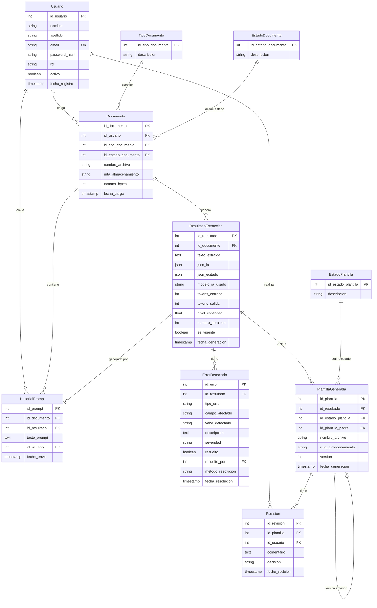

# Diseño Técnico — TarifaIA

## Tabla de contenidos
1. [Arquitectura del sistema](#1-arquitectura-del-sistema)
2. [Modelo de datos](#2-modelo-de-datos)
3. [Diseño de API REST](#3-diseño-de-api-rest)

---

## 1. Arquitectura del sistema

### Visión general

El sistema sigue una arquitectura de tres capas clásica: SPA en React que consume una API REST en FastAPI, con PostgreSQL como base de datos y almacenamiento local para archivos.

```
┌─────────────────────────────────────────────────────────┐
│  Frontend — React + Vite                                │
│  Pages / Components / Services (Axios)                  │
└────────────────────┬────────────────────────────────────┘
                     │ HTTP / JSON
┌────────────────────▼────────────────────────────────────┐
│  Backend — FastAPI                                      │
│  ┌──────────┐  ┌──────────┐  ┌────────────────────┐   │
│  │  Routers │→ │ Services │→ │ Extractor docs      │   │
│  │  (API)   │  │          │→ │ Pandas/pdfplumber/  │   │
│  └──────────┘  └──────────┘  │ python-docx / OCR  │   │
│                      │        └────────────────────┘   │
│                      │→ OpenAI GPT-4.1 (API externa)   │
└──────────────────────┬──────────────────────────────────┘
                       │
          ┌────────────┴──────────────┐
          │                           │
    ┌─────▼──────┐          ┌────────▼────────┐
    │ PostgreSQL │          │  /storage/       │
    │  (datos)   │          │  documentos/     │
    └────────────┘          │  plantillas/     │
                            └─────────────────┘
```

### Capas del backend

| Capa | Carpeta | Responsabilidad |
|---|---|---|
| API | `app/api/` | Routers FastAPI — reciben requests, validan auth, delegan a servicios |
| Servicios | `app/services/` | Lógica de negocio — extracción, procesamiento IA, generación Excel |
| Modelos | `app/models/` | Modelos SQLAlchemy — mapeo ORM a PostgreSQL |
| Schemas | `app/schemas/` | Modelos Pydantic — validación de requests y serialización de responses |
| Core | `app/core/` | Configuración, seguridad JWT, conexión a BD |
| DB | `app/db/` | Sesión de base de datos y migraciones (Alembic) |

### Decisiones de arquitectura

**Procesamiento asíncrono con polling**
El procesamiento de un documento puede tardar 15-90 segundos (OCR + OpenAI). Para evitar timeouts HTTP, el endpoint de procesamiento devuelve `202 Accepted` inmediatamente y el frontend consulta el estado del documento cada N segundos hasta que cambia a `PROCESADO` o `ERROR_PROCESAMIENTO`.

```
POST /documentos/{id}/procesar  →  202 Accepted  (inicia el proceso en background)
GET  /documentos/{id}           →  { estado: "PROCESANDO" }   ← frontend hace polling
GET  /documentos/{id}           →  { estado: "PROCESADO" }    ← frontend muestra resultado
```

**Separación json_ia / json_editado**
El JSON que genera la IA (`json_ia`) nunca se modifica. Las ediciones del operador se almacenan en `json_editado`. Esto garantiza auditoría completa y permite comparar lo que generó la IA vs lo que aprobó el operador.

**Modelo de IA configurable**
El modelo de OpenAI se configura en `.env` con `OPENAI_MODEL=gpt-4.1`. El servicio de IA no tiene el modelo hardcodeado — lo lee desde la configuración. Cambiar de modelo no requiere tocar el código.

**Almacenamiento de archivos**
Los archivos se guardan en disco local bajo `/storage/documentos/` y `/storage/plantillas/`. La base de datos solo guarda la ruta relativa. El servicio de archivos usa una abstracción que permitirá migrar a S3/MinIO cambiando solo la implementación del servicio.

---

## 2. Modelo de datos

### Diagrama entidad-relación



### Descripción de entidades clave

**`Documento`** — El objeto central. Representa el archivo cargado por el operador. Su estado (`CARGADO → PROCESANDO → PROCESADO / ERROR_PROCESAMIENTO`) refleja el ciclo de vida del procesamiento.

**`ResultadoExtraccion`** — Una por cada iteración de procesamiento IA. Almacena `json_ia` (inmutable, lo que generó OpenAI) y `json_editado` (ediciones manuales del operador). El campo `es_vigente` identifica cuál es la iteración activa cuando hay varias.

**`HistorialPrompt`** — Registra cada instrucción adicional enviada por el operador. Se vincula al documento y al `ResultadoExtraccion` que ese prompt generó. La primera extracción (sin prompt) no genera registro aquí.

**`ErrorDetectado`** — Inconsistencias detectadas por la IA o el backend. `severidad` puede ser `INFO`, `WARNING` o `ERROR`. Cuando se resuelve, se registra quién lo hizo, cuándo y cómo (`prompt`, `edicion_manual` o `ignorado`).

**`PlantillaGenerada`** — Archivo Excel generado. `id_plantilla_padre` permite rastrear el árbol de versiones cuando una plantilla es rechazada y se genera una nueva. `version` es un entero incremental por documento.

**`Revision`** — Registro de cada decisión del revisor sobre una plantilla. `decision` es `APROBADA` o `RECHAZADA`.

### Catálogos (tablas de valores fijos)

| Catálogo | Valores |
|---|---|
| `TipoDocumento` | EXCEL, PDF, WORD, IMAGEN |
| `EstadoDocumento` | CARGADO, PROCESANDO, PROCESADO, ERROR_PROCESAMIENTO |
| `EstadoPlantilla` | GENERADA, PENDIENTE_REVISION, APROBADA, RECHAZADA |

---

## 3. Diseño de API REST

Todos los endpoints requieren header `Authorization: Bearer <token>` excepto los de autenticación.
Las respuestas de error siguen el formato: `{ "detail": "mensaje de error" }`.

### Autenticación — `/api/auth`

| Método | Endpoint | Descripción |
|---|---|---|
| `POST` | `/api/auth/login` | Autenticar usuario → devuelve token JWT |
| `POST` | `/api/auth/logout` | Cerrar sesión |
| `GET` | `/api/auth/me` | Retorna datos del usuario autenticado |

**Ejemplo — login:**
```json
// Request
{ "email": "operador@empresa.com", "password": "****" }

// Response 200
{ "access_token": "eyJ...", "token_type": "bearer", "rol": "operador" }
```

---

### Usuarios — `/api/usuarios` *(solo Administrador)*

| Método | Endpoint | Descripción |
|---|---|---|
| `GET` | `/api/usuarios` | Listar todos los usuarios |
| `POST` | `/api/usuarios` | Crear nuevo usuario |
| `PATCH` | `/api/usuarios/{id}` | Activar o desactivar cuenta |

---

### Documentos — `/api/documentos`

| Método | Endpoint | Descripción |
|---|---|---|
| `GET` | `/api/documentos` | Listar documentos del operador autenticado |
| `POST` | `/api/documentos` | Cargar nuevo documento (multipart/form-data) |
| `GET` | `/api/documentos/{id}` | Detalle del documento — incluye estado actual (usado para polling) |
| `GET` | `/api/documentos/{id}/hojas` | Listar hojas disponibles (solo Excel) |
| `POST` | `/api/documentos/{id}/procesar` | Iniciar procesamiento → `202 Accepted` |

**Nota sobre el procesamiento:** El endpoint `POST /procesar` acepta opcionalmente un body con `{ "hojas_seleccionadas": ["Hoja1", "Hoja2"], "prompt": "instrucción adicional" }`. Devuelve `202 Accepted` inmediatamente. El frontend hace polling sobre `GET /documentos/{id}` hasta que el estado cambie.

---

### Resultados — `/api/resultados`

| Método | Endpoint | Descripción |
|---|---|---|
| `GET` | `/api/documentos/{id}/resultados` | Listar iteraciones de procesamiento del documento |
| `GET` | `/api/resultados/{id}` | Detalle del resultado: json_ia, json_editado, errores |
| `PATCH` | `/api/resultados/{id}/editar` | Guardar ediciones manuales del operador en json_editado |

**Ejemplo — guardar edición manual:**
```json
// PATCH /api/resultados/{id}/editar
// Request
{
  "json_editado": {
    "proveedor": "Transportes SAC",
    "items": [
      { "servicio": "Transporte local", "tarifa": 150.00, "moneda": "USD" }
    ]
  }
}
// Response 200
{ "id_resultado": 3, "json_editado": { ... }, "actualizado_en": "2025-06-06T..." }
```

---

### Errores detectados — `/api/errores`

| Método | Endpoint | Descripción |
|---|---|---|
| `GET` | `/api/resultados/{id}/errores` | Listar inconsistencias de un resultado |
| `PATCH` | `/api/errores/{id}/resolver` | Marcar error como resuelto con método y comentario |

---

### Plantillas — `/api/plantillas`

| Método | Endpoint | Descripción |
|---|---|---|
| `GET` | `/api/plantillas` | Listar plantillas (Operador: las propias; Revisor: pendientes) |
| `POST` | `/api/documentos/{id}/plantillas` | Generar nueva plantilla desde el resultado vigente |
| `GET` | `/api/plantillas/{id}` | Detalle de la plantilla |
| `GET` | `/api/plantillas/{id}/descargar` | Descargar archivo Excel |

---

### Revisiones — `/api/revisiones` *(solo Revisor)*

| Método | Endpoint | Descripción |
|---|---|---|
| `GET` | `/api/plantillas/{id}/revisiones` | Historial de revisiones de una plantilla |
| `POST` | `/api/plantillas/{id}/revisiones` | Registrar nueva revisión (aprobar o rechazar) |

**Ejemplo — registrar revisión:**
```json
// POST /api/plantillas/{id}/revisiones
// Request
{
  "decision": "RECHAZADA",
  "comentario": "Las tarifas de la categoría B no corresponden al periodo vigente."
}
// Response 201
{
  "id_revision": 5,
  "decision": "RECHAZADA",
  "comentario": "...",
  "fecha_revision": "2025-06-06T...",
  "revisor": "María García"
}
```

---

### Resumen de endpoints

| Módulo | Endpoints |
|---|---|
| Autenticación | 3 |
| Usuarios | 3 |
| Documentos | 5 |
| Resultados | 3 |
| Errores | 2 |
| Plantillas | 4 |
| Revisiones | 2 |
| **Total** | **22** |

---

*Fase 1 — Análisis y Diseño | Versión 1.0*
